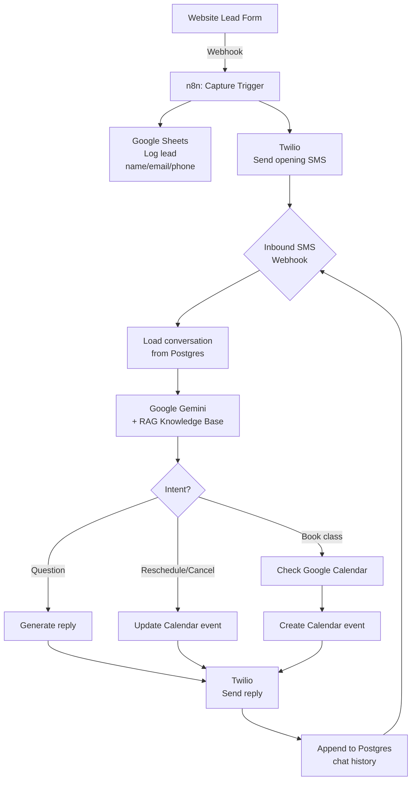

# 01 — Conversational Lead-Capture & Booking System

**Domain:** Martial arts gym (lead generation and trial-class booking)
**Status:** Deployed on self-hosted n8n (production)

A fully automated lead nurture and booking system triggered by website form submissions. Prospects receive immediate SMS outreach, hold a natural two-way conversation with an LLM grounded in the gym's knowledge base, and can book, reschedule, or cancel trial classes entirely through text messaging.

---

## Problem

Small gyms lose leads between form submission and first contact. Manual follow-up is slow, inconsistent, and doesn't scale. A full CRM is overkill, and generic auto-reply tools can't handle the specific questions prospects ask before committing to a trial class ("What's the schedule for kids' BJJ? Do I need a gi? How much?").

## Solution

An n8n workflow that sits between the website form and the gym's calendar. Every lead gets a personalized, context-aware conversation that either books a trial class or captures enough information for a human follow-up.

---

## Architecture



---

## Key n8n Patterns

### 1. Two-way webhook architecture
Two webhook entry points: one for the initial website form, one for inbound SMS replies from Twilio. The two flows share state via PostgreSQL rather than keeping conversation context in memory.

### 2. RAG grounding for the LLM
The LLM is not free to hallucinate gym details. A custom retrieval layer pulls the most relevant context (class schedule, pricing, location, required gear) before every LLM call. This keeps answers accurate and on-brand.

### 3. PostgreSQL-backed chat memory
Each prospect's conversation is keyed by phone number and stored with custom session tables. This enables:
- Multi-day conversations that pick up where they left off
- Analytics on drop-off points
- Human handoff with full conversation history

### 4. LLM-driven calendar actions
Rather than keyword matching for "book a class," the LLM returns a structured JSON response with an intent field. Downstream n8n nodes route based on intent: `book`, `reschedule`, `cancel`, `question`, `handoff`.

Example structured output:
```json
{
  "intent": "book",
  "reply_text": "Great — I have Tuesday at 6pm or Thursday at 7pm open for a free trial. Which works?",
  "slot_requested": null,
  "confidence": 0.92
}
```

### 5. Graceful degradation
If the LLM call fails or confidence is below threshold, the workflow flags the conversation for human follow-up rather than sending a generic error. Lead is never lost.

---

## Tech Stack

| Component | Purpose |
|-----------|---------|
| n8n (self-hosted, Docker) | Workflow orchestration |
| Twilio | SMS send/receive |
| Google Gemini | Natural language understanding, reply generation |
| PostgreSQL | Chat memory, session state, knowledge base vectors |
| Google Sheets | Lead log (accessible to gym owner) |
| Google Calendar | Trial class scheduling |

---

## Screenshots

Workflow canvas and node-list screenshots available in [`./screenshots`](./screenshots). All client data, webhook URLs, and credentials have been redacted.

## Diagrams

Mermaid source for the architecture diagram above is in [`./diagrams`](./diagrams).

---

## Why This Project Matters for Workflow Development

This workflow demonstrates the full lifecycle of an AI-powered automation: external trigger, stateful multi-turn interaction, structured LLM output driving deterministic downstream actions, and graceful failure handling. It's not a demo — it runs in production for a paying business and has handled end-to-end lead capture through class booking without human intervention.
