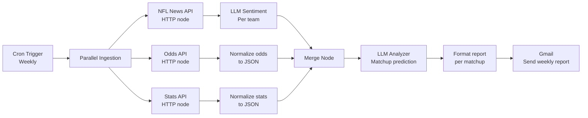

# 02 — NFL Matchup Prediction Pipeline

**Domain:** Sports analytics / data aggregation
**Status:** Deployed on self-hosted n8n (personal use)

An automated pipeline that ingests NFL news, betting odds, and team statistics from multiple sources, performs LLM-driven sentiment analysis on news coverage, and produces a weekly game-by-game prediction with supporting rationale delivered by email.

---

## Problem

Predicting NFL matchups requires synthesizing three very different types of data:

1. **Quantitative:** team stats, injury reports, betting odds
2. **Qualitative:** news coverage, analyst takes, player status updates
3. **Contextual:** home/away, recent form, matchup history

Manually gathering and synthesizing this for every matchup each week is tedious. This pipeline automates the collection and synthesis.

---

## Architecture



---

## Key n8n Patterns

### 1. Parallel ingestion with Merge
Three independent HTTP requests fire in parallel for each data source. A Merge node waits for all three before advancing to synthesis. This is substantially faster than sequential calls and isolates failures — if the stats API is down, the news and odds branches still complete.

### 2. LLM for sentiment, not just generation
Each news article runs through an LLM call scored for team sentiment (bullish / bearish / neutral) with a confidence score. Aggregating across articles produces a team-level sentiment signal that survives any one article being noisy or clickbait.

Example structured output from the sentiment node:
```json
{
  "team": "Kansas City Chiefs",
  "sentiment": "bullish",
  "confidence": 0.78,
  "key_signals": [
    "Mahomes cleared from injury report",
    "Defense ranked top-5 against the pass"
  ]
}
```

### 3. JSON normalization as a first-class step
Raw API responses from different providers have wildly inconsistent schemas. A dedicated Function/Set node per source normalizes to a common internal schema before merging. Downstream nodes don't care where the data came from.

### 4. Per-matchup iteration
The final LLM analyzer runs once per matchup, not once for the whole slate. This keeps prompts focused, outputs comparable, and token usage bounded.

### 5. Email as the delivery channel
No dashboard, no UI, no additional infrastructure. The weekly report lands in Gmail as a readable digest with the prediction, rationale, and closing odds for each game.

---

## Tech Stack

| Component | Purpose |
|-----------|---------|
| n8n (self-hosted, Docker) | Workflow orchestration |
| NFL News API (third-party) | News article ingestion |
| Odds API | Betting odds feed |
| Stats API | Team statistics |
| Google Gemini | Sentiment analysis, matchup prediction |
| Gmail | Weekly report delivery |

---

## Screenshots

Workflow canvas and node-list screenshots available in [`./screenshots`](./screenshots). All API keys, endpoint URLs, and credential names have been redacted.

## Diagrams

Mermaid source for the architecture diagram above is in [`./diagrams`](./diagrams).

---

## Why This Project Matters for Workflow Development

This pipeline demonstrates data engineering patterns applied to automation: parallel ingestion, schema normalization, data fusion, and structured LLM outputs. The sentiment step shows a useful pattern for using LLMs where they shine (unstructured text) while keeping deterministic logic (merging, math, routing) in n8n itself.
