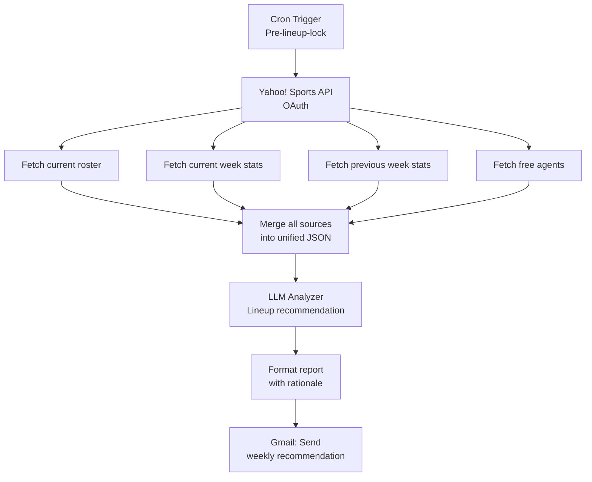

# 03 — NFL Fantasy Lineup Optimizer

**Domain:** Fantasy sports / decision support
**Status:** Deployed on self-hosted n8n (personal use)

A scheduled pipeline that pulls live fantasy roster data from the Yahoo! Sports API, combines current-week and previous-week stats with the free-agent pool, and uses an LLM to recommend a starting lineup with supporting rationale — delivered by email before weekly lineup lock.

---

## Problem

Setting an optimal fantasy football lineup each week means cross-referencing:

- Your current roster
- Each player's stats this season and last week
- The free-agent pool for potential pickups
- Matchup considerations and injury status

Doing this manually every week is time-consuming. Commercial tools exist but are either expensive, generic, or don't integrate with the league provider you actually use.

---

## Architecture



---

## Key n8n Patterns

### 1. OAuth-secured API integration
The Yahoo! Sports API requires OAuth 2.0. n8n's built-in credential system handles token refresh, so the workflow can run on a schedule without manual re-auth. Critical pattern for any authenticated third-party integration.

### 2. Multi-endpoint data assembly
Four separate API calls against different Yahoo! Sports endpoints — roster, current-week stats, previous-week stats, free agents — assembled into one payload that the LLM can reason over. Each call is isolated so one failure doesn't kill the whole run.

### 3. Unified JSON payload for the LLM
Rather than asking the LLM to reconcile four different input formats, a Set/Function node produces a single normalized payload:

```json
{
  "roster": [
    { "player": "...", "position": "...", "this_week_proj": 14.2, "last_week_actual": 18.7 }
  ],
  "free_agents": [
    { "player": "...", "position": "...", "proj": 12.1, "ownership_pct": 34 }
  ],
  "context": { "week": 7, "generated_at": "..." }
}
```

### 4. Structured LLM recommendation
The LLM returns a structured decision with both the recommendation and the reasoning, so the email is actionable rather than just a lineup printout:

```json
{
  "start": [
    { "position": "RB1", "player": "...", "reason": "Top-5 projected; favorable matchup vs. bottom-10 rush defense" }
  ],
  "sit": [
    { "position": "BENCH", "player": "...", "reason": "On bye; also questionable for following week" }
  ],
  "waiver_suggestions": [
    { "player": "...", "reason": "Lead back following injury to starter; 18% owned" }
  ]
}
```

### 5. Scheduled execution as a feature
The workflow runs automatically before weekly lineup lock. No need to remember to check — the recommendation lands in the inbox at the right time, every week of the season.

---

## Tech Stack

| Component | Purpose |
|-----------|---------|
| n8n (self-hosted, Docker) | Workflow orchestration |
| Yahoo! Sports API (OAuth 2.0) | Fantasy roster and stats |
| Google Gemini | Lineup analysis and recommendation |
| Gmail | Weekly delivery |

---

## Screenshots

Workflow canvas and node-list screenshots available in [`./screenshots`](./screenshots). All OAuth credentials, league IDs, and personal identifiers have been redacted.

## Diagrams

Mermaid source for the architecture diagram above is in [`./diagrams`](./diagrams).

---

## Why This Project Matters for Workflow Development

This project shows a different pattern than the conversational and sentiment-based projects: a scheduled, idempotent, OAuth-authenticated data assembly job that outputs structured decisions rather than content. It's the pattern most enterprise automation work takes — pull from authenticated sources, normalize, analyze, deliver — compressed into a clean n8n workflow.
