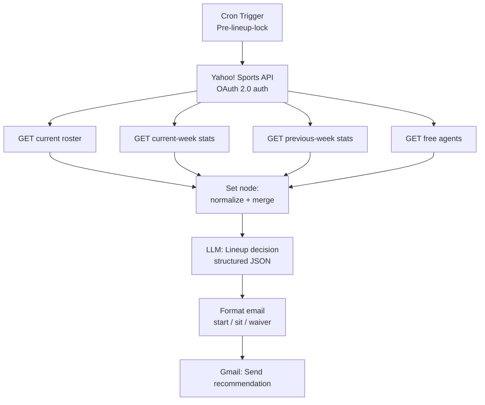

## How to render

This diagram renders automatically on GitHub inside a markdown file. To render locally or export as an image, use the [Mermaid Live Editor](https://mermaid.live) and paste the fenced code block above.
